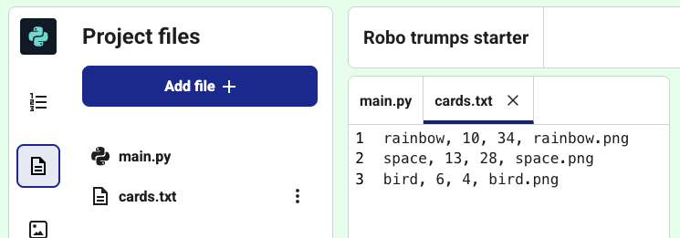

<h2 class="c-project-heading--task">Open robot data file</h2>
--- task ---
Open the file that stores data for different robots.
--- /task ---

--- task ---
Open **cards.txt** by clicking the file icon.
--- /task ---

In the **cards.txt** file you can see that each robot has some data:

- name  
- intelligence rating  
- battery life  
- image file name  

The items are separated by commas in the file.

--- task ---
Copy the code below to open the file in your project.
--- /task ---

--- code ---
---
language: python
filename: main.py
line_numbers: true
line_number_start: 1
line_highlights: 4-5
---
from turtle import *
from random import choice

file = open('cards.txt', 'r')
print(file.read())  # Print to test
--- /code ---
--- task ---
**Test:** Run the code. You should see the cards data in the **Text output** tab.
--- /task ---

<pre>rainbow, 10, 34, rainbow.png
space, 13, 28, space.png
bird, 6, 4, bird.png</pre>

