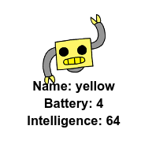

<h2 class="c-project-heading--task">Challenge: Add more robots</h2>

Add data about more robots to `cards.txt`.

<h2 class="c-project-heading--explainer">Follow these instructions</h2>

Click on the images button to see the robot images that you can use. 

You get to decide how much battery and intelligence they have.

## Now run your code

Confirm the observable result.
